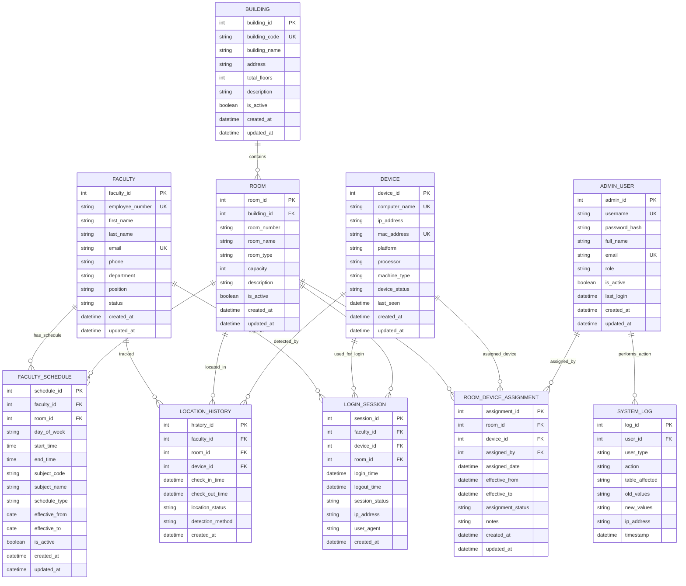

# Faculty Locator System - Entity Relationship Diagram & Database Schema

## System Overview
The Faculty Locator System is designed to track faculty members' locations based on device assignments to specific rooms. The system uses device identification (computer name, IP address, MAC address) to automatically determine room assignments and authenticate faculty logins.

## Entity Relationship Diagram



## Database Schema (SQL)

### 1. Faculty Table
```sql
CREATE TABLE faculty (
    faculty_id INT PRIMARY KEY AUTO_INCREMENT,
    employee_number VARCHAR(20) UNIQUE NOT NULL,
    first_name VARCHAR(50) NOT NULL,
    last_name VARCHAR(50) NOT NULL,
    email VARCHAR(100) UNIQUE NOT NULL,
    phone VARCHAR(20),
    department VARCHAR(100),
    position VARCHAR(100),
    status ENUM('active', 'inactive', 'on_leave') DEFAULT 'active',
    created_at TIMESTAMP DEFAULT CURRENT_TIMESTAMP,
    updated_at TIMESTAMP DEFAULT CURRENT_TIMESTAMP ON UPDATE CURRENT_TIMESTAMP,
    
    INDEX idx_employee_number (employee_number),
    INDEX idx_email (email),
    INDEX idx_department (department),
    INDEX idx_status (status)
);
```

### 2. Building Table
```sql
CREATE TABLE building (
    building_id INT PRIMARY KEY AUTO_INCREMENT,
    building_code VARCHAR(10) UNIQUE NOT NULL,
    building_name VARCHAR(100) NOT NULL,
    address TEXT,
    total_floors INT DEFAULT 1,
    description TEXT,
    is_active BOOLEAN DEFAULT TRUE,
    created_at TIMESTAMP DEFAULT CURRENT_TIMESTAMP,
    updated_at TIMESTAMP DEFAULT CURRENT_TIMESTAMP ON UPDATE CURRENT_TIMESTAMP,
    
    INDEX idx_building_code (building_code),
    INDEX idx_is_active (is_active)
);
```

### 3. Room Table
```sql
CREATE TABLE room (
    room_id INT PRIMARY KEY AUTO_INCREMENT,
    building_id INT NOT NULL,
    room_number VARCHAR(20) NOT NULL,
    room_name VARCHAR(100),
    room_type ENUM('classroom', 'laboratory', 'office', 'conference', 'library', 'other') DEFAULT 'classroom',
    capacity INT DEFAULT 0,
    description TEXT,
    is_active BOOLEAN DEFAULT TRUE,
    created_at TIMESTAMP DEFAULT CURRENT_TIMESTAMP,
    updated_at TIMESTAMP DEFAULT CURRENT_TIMESTAMP ON UPDATE CURRENT_TIMESTAMP,
    
    FOREIGN KEY (building_id) REFERENCES building(building_id) ON DELETE CASCADE,
    UNIQUE KEY unique_room_per_building (building_id, room_number),
    INDEX idx_room_type (room_type),
    INDEX idx_is_active (is_active)
);
```

### 4. Device Table
```sql
CREATE TABLE device (
    device_id INT PRIMARY KEY AUTO_INCREMENT,
    computer_name VARCHAR(100) UNIQUE NOT NULL,
    ip_address VARCHAR(45),
    mac_address VARCHAR(17) UNIQUE NOT NULL,
    platform VARCHAR(50),
    processor VARCHAR(200),
    machine_type VARCHAR(100),
    device_status ENUM('active', 'inactive', 'maintenance') DEFAULT 'active',
    last_seen TIMESTAMP DEFAULT CURRENT_TIMESTAMP,
    created_at TIMESTAMP DEFAULT CURRENT_TIMESTAMP,
    updated_at TIMESTAMP DEFAULT CURRENT_TIMESTAMP ON UPDATE CURRENT_TIMESTAMP,
    
    INDEX idx_computer_name (computer_name),
    INDEX idx_mac_address (mac_address),
    INDEX idx_ip_address (ip_address),
    INDEX idx_device_status (device_status),
    INDEX idx_last_seen (last_seen)
);
```

### 5. Room Device Assignment Table
```sql
CREATE TABLE room_device_assignment (
    assignment_id INT PRIMARY KEY AUTO_INCREMENT,
    room_id INT NOT NULL,
    device_id INT NOT NULL,
    assigned_by INT NOT NULL,
    assigned_date TIMESTAMP DEFAULT CURRENT_TIMESTAMP,
    effective_from TIMESTAMP DEFAULT CURRENT_TIMESTAMP,
    effective_to TIMESTAMP NULL,
    assignment_status ENUM('active', 'inactive', 'pending') DEFAULT 'active',
    notes TEXT,
    created_at TIMESTAMP DEFAULT CURRENT_TIMESTAMP,
    updated_at TIMESTAMP DEFAULT CURRENT_TIMESTAMP ON UPDATE CURRENT_TIMESTAMP,
    
    FOREIGN KEY (room_id) REFERENCES room(room_id) ON DELETE CASCADE,
    FOREIGN KEY (device_id) REFERENCES device(device_id) ON DELETE CASCADE,
    FOREIGN KEY (assigned_by) REFERENCES admin_user(admin_id),
    INDEX idx_room_device (room_id, device_id),
    INDEX idx_assignment_status (assignment_status),
    INDEX idx_effective_dates (effective_from, effective_to)
);
```

### 6. Login Session Table
```sql
CREATE TABLE login_session (
    session_id INT PRIMARY KEY AUTO_INCREMENT,
    faculty_id INT NOT NULL,
    device_id INT NOT NULL,
    room_id INT,
    login_time TIMESTAMP DEFAULT CURRENT_TIMESTAMP,
    logout_time TIMESTAMP NULL,
    session_status ENUM('active', 'expired', 'logged_out') DEFAULT 'active',
    ip_address VARCHAR(45),
    user_agent TEXT,
    created_at TIMESTAMP DEFAULT CURRENT_TIMESTAMP,
    
    FOREIGN KEY (faculty_id) REFERENCES faculty(faculty_id) ON DELETE CASCADE,
    FOREIGN KEY (device_id) REFERENCES device(device_id) ON DELETE CASCADE,
    FOREIGN KEY (room_id) REFERENCES room(room_id) ON DELETE SET NULL,
    INDEX idx_faculty_session (faculty_id, session_status),
    INDEX idx_login_time (login_time),
    INDEX idx_session_status (session_status)
);
```

### 7. Faculty Schedule Table
```sql
CREATE TABLE faculty_schedule (
    schedule_id INT PRIMARY KEY AUTO_INCREMENT,
    faculty_id INT NOT NULL,
    room_id INT NOT NULL,
    day_of_week ENUM('monday', 'tuesday', 'wednesday', 'thursday', 'friday', 'saturday', 'sunday') NOT NULL,
    start_time TIME NOT NULL,
    end_time TIME NOT NULL,
    subject_code VARCHAR(20),
    subject_name VARCHAR(200),
    schedule_type ENUM('regular', 'makeup', 'special') DEFAULT 'regular',
    effective_from DATE NOT NULL,
    effective_to DATE,
    is_active BOOLEAN DEFAULT TRUE,
    created_at TIMESTAMP DEFAULT CURRENT_TIMESTAMP,
    updated_at TIMESTAMP DEFAULT CURRENT_TIMESTAMP ON UPDATE CURRENT_TIMESTAMP,
    
    FOREIGN KEY (faculty_id) REFERENCES faculty(faculty_id) ON DELETE CASCADE,
    FOREIGN KEY (room_id) REFERENCES room(room_id) ON DELETE CASCADE,
    INDEX idx_faculty_schedule (faculty_id, day_of_week, start_time),
    INDEX idx_room_schedule (room_id, day_of_week, start_time),
    INDEX idx_effective_dates (effective_from, effective_to),
    INDEX idx_is_active (is_active)
);
```

### 8. Location History Table
```sql
CREATE TABLE location_history (
    history_id INT PRIMARY KEY AUTO_INCREMENT,
    faculty_id INT NOT NULL,
    room_id INT NOT NULL,
    device_id INT NOT NULL,
    check_in_time TIMESTAMP DEFAULT CURRENT_TIMESTAMP,
    check_out_time TIMESTAMP NULL,
    location_status ENUM('present', 'absent', 'unknown') DEFAULT 'present',
    detection_method ENUM('login', 'auto_detect', 'manual', 'schedule') DEFAULT 'login',
    created_at TIMESTAMP DEFAULT CURRENT_TIMESTAMP,
    
    FOREIGN KEY (faculty_id) REFERENCES faculty(faculty_id) ON DELETE CASCADE,
    FOREIGN KEY (room_id) REFERENCES room(room_id) ON DELETE CASCADE,
    FOREIGN KEY (device_id) REFERENCES device(device_id) ON DELETE CASCADE,
    INDEX idx_faculty_location (faculty_id, check_in_time),
    INDEX idx_room_occupancy (room_id, check_in_time),
    INDEX idx_detection_method (detection_method),
    INDEX idx_location_status (location_status)
);
```

### 9. Admin User Table
```sql
CREATE TABLE admin_user (
    admin_id INT PRIMARY KEY AUTO_INCREMENT,
    username VARCHAR(50) UNIQUE NOT NULL,
    password_hash VARCHAR(255) NOT NULL,
    full_name VARCHAR(100) NOT NULL,
    email VARCHAR(100) UNIQUE NOT NULL,
    role ENUM('super_admin', 'admin', 'operator') DEFAULT 'admin',
    is_active BOOLEAN DEFAULT TRUE,
    last_login TIMESTAMP NULL,
    created_at TIMESTAMP DEFAULT CURRENT_TIMESTAMP,
    updated_at TIMESTAMP DEFAULT CURRENT_TIMESTAMP ON UPDATE CURRENT_TIMESTAMP,
    
    INDEX idx_username (username),
    INDEX idx_email (email),
    INDEX idx_role (role),
    INDEX idx_is_active (is_active)
);
```

### 10. System Log Table
```sql
CREATE TABLE system_log (
    log_id INT PRIMARY KEY AUTO_INCREMENT,
    user_id INT,
    user_type ENUM('faculty', 'admin') NOT NULL,
    action VARCHAR(100) NOT NULL,
    table_affected VARCHAR(50),
    old_values JSON,
    new_values JSON,
    ip_address VARCHAR(45),
    timestamp TIMESTAMP DEFAULT CURRENT_TIMESTAMP,
    
    INDEX idx_user_log (user_id, user_type),
    INDEX idx_action (action),
    INDEX idx_timestamp (timestamp),
    INDEX idx_table_affected (table_affected)
);
```

## Key Features of the Database Design

### 1. **Device Management**
- Unique identification using computer name and MAC address
- IP address tracking for network-based location
- Device status and last seen timestamps
- Platform and hardware information storage

### 2. **Room Assignment System**
- Flexible room-device assignments with effective date ranges
- Support for multiple buildings and room types
- Assignment history and audit trail
- Admin user tracking for assignments

### 3. **Faculty Tracking**
- Complete faculty profile management
- Login session tracking with device correlation
- Location history with multiple detection methods
- Schedule-based expected location tracking

### 4. **Security & Auditing**
- Admin user management with role-based access
- Comprehensive system logging
- Password hashing for admin accounts
- Session management for security

### 5. **Scalability Features**
- Proper indexing for performance
- Foreign key constraints for data integrity
- Flexible enum values for future expansion
- JSON fields for complex data storage

## Integration with Current System

The current JSON-based configuration can be migrated to this database structure:

1. **Device Detection** → `device` table
2. **Room Assignments** → `room_device_assignment` table
3. **Login Tracking** → `login_session` table
4. **Admin Operations** → `admin_user` and `system_log` tables

This design provides a robust foundation for a comprehensive faculty locator system with room for future enhancements like real-time tracking, mobile app integration, and advanced reporting capabilities.