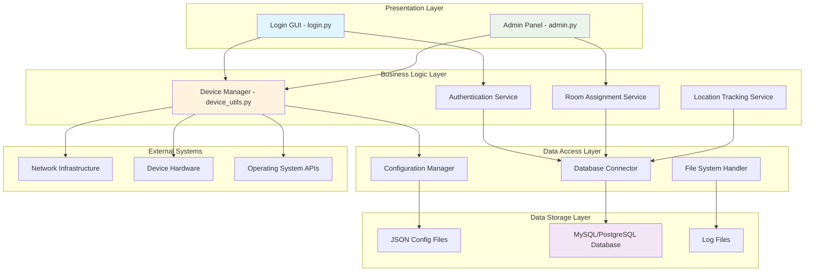
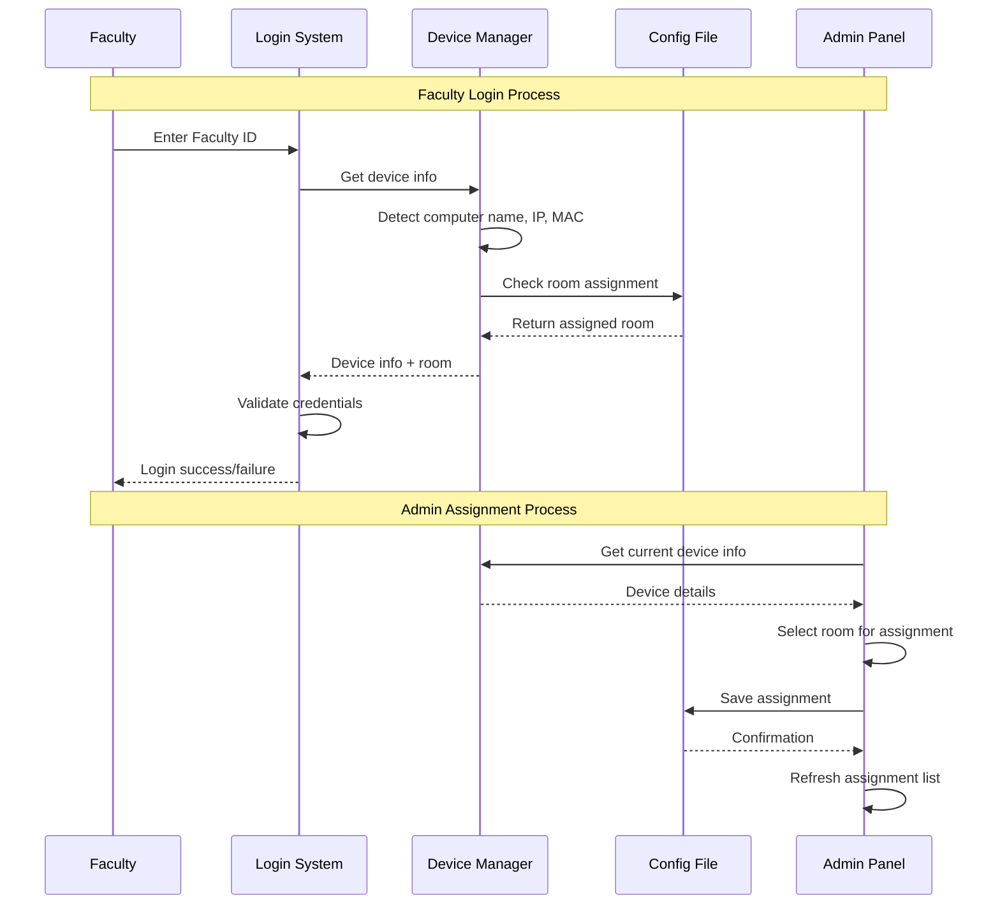

# Faculty Locator System - Architecture Documentation

## System Overview

The Faculty Locator System is a comprehensive solution designed to track faculty members' locations within an educational institution by correlating device identification with room assignments. The system provides real-time location tracking, automated login processes, and administrative management capabilities.

## Architecture Diagram



## Component Architecture

### 1. **Presentation Layer Components**

#### Login System ([`login.py`](login.py))
- **Purpose**: Faculty authentication and room display interface
- **Key Features**:
  - Device information display
  - Dynamic room assignment visualization
  - Faculty ID authentication
  - Status indicators for room assignment
  - Admin panel launcher

#### Admin Panel ([`../desktop_app/admin.py`](../desktop_app/admin.py))
- **Purpose**: Administrative interface for system management
- **Key Features**:
  - Real-time device detection and information display
  - Room assignment management
  - Assignment history tracking
  - Configuration export/import
  - Bulk operations (clear all assignments)

### 2. **Business Logic Layer Components**

#### Device Manager ([`../desktop_app/device_utils.py`](../desktop_app/device_utils.py))
- **Purpose**: Core device identification and management
- **Key Functions**:
  - Cross-platform device information extraction
  - MAC address detection (Windows/Linux/Mac)
  - IP address resolution
  - Room assignment retrieval
  - Configuration file management

#### Authentication Service (Future Enhancement)
- **Purpose**: Secure faculty authentication
- **Planned Features**:
  - Password hashing and verification
  - Session management
  - Multi-factor authentication support
  - LDAP/Active Directory integration

#### Room Assignment Service (Future Enhancement)
- **Purpose**: Intelligent room assignment logic
- **Planned Features**:
  - Schedule-based automatic assignments
  - Conflict detection and resolution
  - Capacity management
  - Assignment validation

### 3. **Data Flow Architecture**



## Data Architecture

### Current Implementation (JSON-based)
```json
{
  "DESKTOP-ABC123_192.168.1.100": {
    "computer_name": "DESKTOP-ABC123",
    "ip_address": "192.168.1.100",
    "mac_address": "AA:BB:CC:DD:EE:FF",
    "room": "Room 101",
    "assigned_date": "2024-01-15 10:30:00"
  }
}
```

### Future Database Implementation
- **Primary Key**: Composite key using device_id and assignment_id
- **Foreign Keys**: Links to faculty, room, and admin tables
- **Indexing**: Optimized for device lookup and room queries
- **Constraints**: Ensures data integrity and prevents conflicts

## Security Architecture

### Current Security Measures
1. **Device Identification**: MAC address + computer name uniqueness
2. **Local File Access**: JSON configuration files with file system permissions
3. **Simple Authentication**: Basic faculty ID validation

### Enhanced Security (Database Implementation)
1. **Password Hashing**: bcrypt/Argon2 for admin passwords
2. **Session Management**: Secure session tokens with expiration
3. **Role-Based Access**: Different permission levels for users
4. **Audit Logging**: Complete action tracking and logging
5. **Network Security**: IP-based access restrictions

## Deployment Architecture

### Current Deployment
```
Faculty Computer (Windows/Linux/Mac)
├── login.py (Faculty Interface)
├── admin.py (Admin Interface)
├── device_utils.py (Core Logic)
└── room_config.json (Data Storage)
```

### Recommended Production Deployment
```
Application Server
├── Web Interface (Flask/Django)
├── API Layer (REST/GraphQL)
├── Business Logic Services
└── Database Connection Pool

Database Server
├── MySQL/PostgreSQL
├── Backup Systems
└── Replication Setup

Client Devices
├── Thin Client Applications
├── Web Browser Access
└── Mobile Applications
```

## Integration Points

### 1. **Network Infrastructure Integration**
- **DHCP Server**: IP address assignment tracking
- **DNS Server**: Hostname resolution
- **Network Switches**: MAC address table access
- **WiFi Controllers**: Device location triangulation

### 2. **Identity Management Integration**
- **Active Directory**: Faculty authentication
- **LDAP**: User directory services
- **Single Sign-On**: Seamless authentication
- **HR Systems**: Employee data synchronization

### 3. **Facility Management Integration**
- **Room Booking Systems**: Schedule coordination
- **Building Management**: Access control integration
- **Asset Management**: Device inventory tracking
- **Maintenance Systems**: Equipment status updates

## Performance Considerations

### Current System Performance
- **Startup Time**: < 2 seconds for GUI initialization
- **Device Detection**: < 1 second for local device info
- **File I/O**: Minimal latency for JSON operations
- **Memory Usage**: < 50MB for complete application

### Scalability Improvements
- **Database Indexing**: Sub-second query response times
- **Connection Pooling**: Efficient database connections
- **Caching Layer**: Redis/Memcached for frequent queries
- **Load Balancing**: Multiple application server instances

## Monitoring and Maintenance

### System Health Monitoring
1. **Device Connectivity**: Regular ping tests and status checks
2. **Application Performance**: Response time monitoring
3. **Database Health**: Query performance and connection status
4. **Storage Usage**: Configuration file size and database growth

### Maintenance Procedures
1. **Regular Backups**: Automated configuration and database backups
2. **Log Rotation**: Automated cleanup of old log files
3. **Software Updates**: Scheduled maintenance windows
4. **Security Patches**: Regular security update deployment

## Future Enhancements

### Phase 1: Database Migration
- Convert JSON storage to relational database
- Implement proper user authentication
- Add comprehensive logging and auditing

### Phase 2: Web Interface
- Develop web-based admin panel
- Create faculty self-service portal
- Implement real-time dashboard

### Phase 3: Advanced Features
- Mobile application development
- IoT sensor integration
- Machine learning for predictive analytics
- Integration with calendar systems

### Phase 4: Enterprise Features
- Multi-campus support
- Advanced reporting and analytics
- API for third-party integrations
- Compliance and regulatory features

## Technology Stack

### Current Stack
- **Language**: Python 3.x
- **GUI Framework**: Tkinter
- **Data Storage**: JSON files
- **System APIs**: Native OS commands

### Recommended Future Stack
- **Backend**: Python (Django/Flask) or Node.js
- **Frontend**: React/Vue.js or modern web framework
- **Database**: PostgreSQL or MySQL
- **Caching**: Redis
- **Message Queue**: RabbitMQ or Apache Kafka
- **Monitoring**: Prometheus + Grafana
- **Deployment**: Docker + Kubernetes

This architecture provides a solid foundation for the current system while offering a clear path for future enhancements and scalability improvements.
